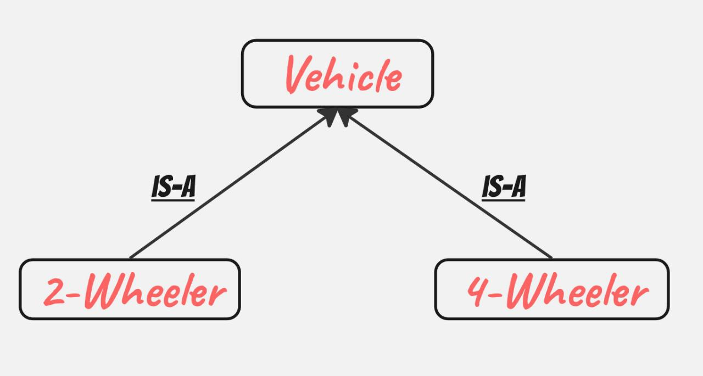
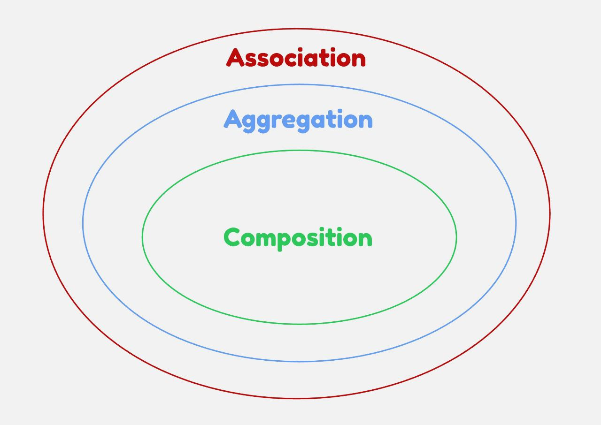
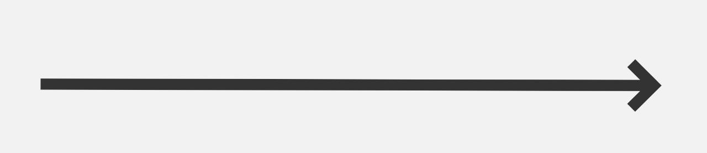

= Low Level Design (LLD)

* It majorly focuses on *classes* and *objects* within a system.

image::IMAGES/LEC_1/IMG_1.jpg[Representation of LLD]

== Goal

* To write _clean code_.
* Code should be _flexible_ and _maintainable_.
* Code should be _easy to test_.

image::IMAGES/LEC_1/IMG_2.jpg[Categories of Design Pattern]

== Creational Patterns

* It controls the object creation.
* Various types of *Creational Patterns* are:
** Singleton
** Builder
** Factory
** Abstract Factory
** Object Pool
** Prototype

'''

== Structural Patterns

* It focuses on how different *classes/objects* are arranged together so that a *larger problem* can be solved in the *most flexible way*.
* Various patterns are:
** Decorator
** Proxy
** Composite
** Adapter
** Bridge
** Façade
** Flyweight

'''

== Behavioral Patterns

* It focuses on how different *objects communicate or interact* with each other.
* In other words, once the structure (skeleton) is created using *Structural Patterns*, the *coordination, responsibility, and interaction* are guided by *Behavioral Patterns*.
* Various patterns are:
** State
** Strategy
** Observer
** Chain of Responsibility
** Template
** Iterator
** Interpreter
** Command
** Visitor
** Mediator
** Memento
** Null Object

'''

[#_has_a_and_is_a_relationship]
==========================================

== is-a Relationship

* This is nothing but _inheritance_.

== has-a Relationship

* Shows a *link between two objects*.
** House has rooms
** Library has books
** School has students

'''

== Association

* General term for *has-a* relationship.
* Association representation:

'''

= Types of Association
==========================================

== Weak Relationship (Aggregation)

* *Existence of one object is not dependent on another*.
* Example: _Library has books_

* Here both objects are independent of each other.
* If books are not present, *Library can still exist*.
* If Library does not exist, *books can still exist independently*.

[source,java]
----
public class Library {
    List<Books> books;
}
----

'''

== Strong Relationship (Composition)

* *Existence of one object is dependent on another*.
* Example: _House has rooms_
* Here, *room existence depends on House*.
* If House does not exist, *rooms will also not exist*.

[source,java]
----
public class House {
    List<Rooms> rooms;

    // also takes care of creation and managing of Room objects
    public House() {
        rooms = new ArrayList<>();
        rooms.add(new Room("Living Room"));
        rooms.add(new Room("Bedroom"));
    }
}
----
