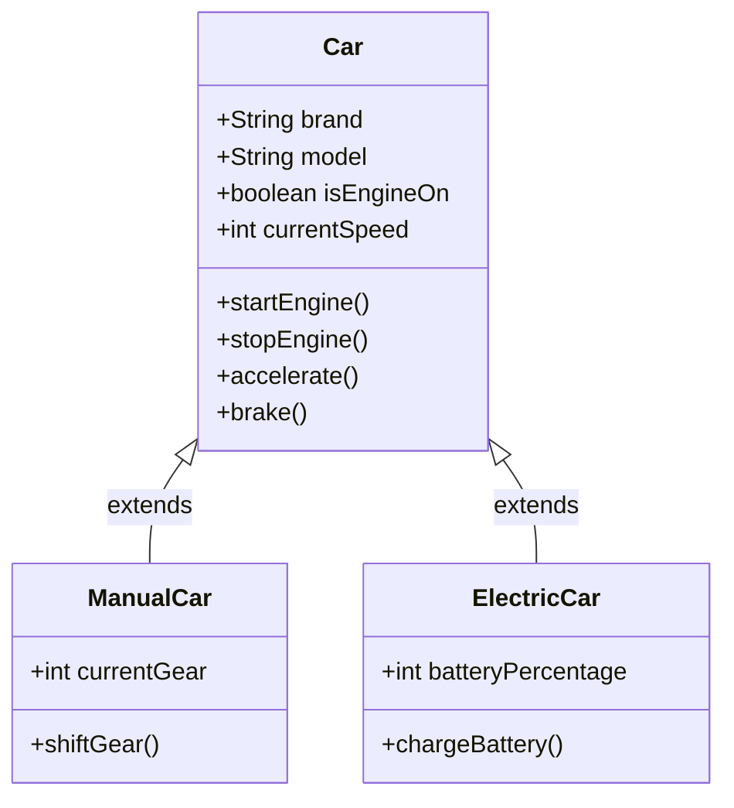

# 🧬 Inheritance in Java

## 📖 What is Inheritance?
Inheritance is an OOP concept where a **child class** acquires the properties and behaviours of a **parent class**. The child class can reuse the parent's fields and methods, and also add its own on top. This promotes **code reusability** and establishes a natural **IS-A relationship**. ♻️

---

## 🚗 Understanding via the Car Diagram



### Parent Class — `Car`

The `Car` class is the **base/parent class**. It defines the common attributes and behaviours that every car — regardless of type — will have.

**Attributes (Fields):** 📦
- `brand`
- `model`
- `isEngineOn`
- `currentSpeed`

**Behaviours (Methods):** ⚙️
- `startEngine()`
- `stopEngine()`
- `accelerate()`
- `brake()`

---

### Child Classes — `ManualCar` & `ElectricCar`

Both `ManualCar` and `ElectricCar` **extend** the `Car` class. This means they automatically inherit all fields and methods of `Car`, and each adds its own unique properties on top.

#### 🔧 `ManualCar extends Car`
- **Extra Field:** `currentGear`
- **Extra Method:** `shiftGear()`

#### ⚡ `ElectricCar extends Car`
- **Extra Field:** `batteryPercentage`
- **Extra Method:** `chargeBattery()`

---

## 💡 Intuition
Think of it this way — every `ManualCar` IS-A `Car`, and every `ElectricCar` IS-A `Car`. They both share the core identity of a car (start, stop, accelerate, brake), but each has something unique to its own type. Rather than rewriting the common logic in both classes, we define it **once** in `Car` and **inherit** it. 🎯

---

## ☕ Java Code

```java
// Parent class
class Car {
    String brand;
    String model;
    boolean isEngineOn;
    int currentSpeed;

    void startEngine() {
        isEngineOn = true;
        System.out.println(brand + " engine started.");
    }

    void stopEngine() {
        isEngineOn = false;
        System.out.println(brand + " engine stopped.");
    }

    void accelerate() {
        currentSpeed += 10;
        System.out.println("Speed: " + currentSpeed);
    }

    void brake() {
        currentSpeed -= 10;
        System.out.println("Speed: " + currentSpeed);
    }
}

// Child class 1
class ManualCar extends Car {
    int currentGear;

    void shiftGear(int gear) {
        currentGear = gear;
        System.out.println("Shifted to gear: " + currentGear);
    }
}

// Child class 2
class ElectricCar extends Car {
    int batteryPercentage;

    void chargeBattery() {
        batteryPercentage = 100;
        System.out.println(brand + " battery fully charged.");
    }
}

// Main class
public class InheritanceDemo {
    public static void main(String[] args) {

        ManualCar manual = new ManualCar();
        manual.brand = "Toyota";
        manual.model = "Corolla";
        manual.startEngine();       // Inherited from Car ✅
        manual.accelerate();        // Inherited from Car ✅
        manual.shiftGear(3);        // Own method ✅

        System.out.println();

        ElectricCar electric = new ElectricCar();
        electric.brand = "Tesla";
        electric.model = "Model 3";
        electric.batteryPercentage = 40;
        electric.startEngine();     // Inherited from Car ✅
        electric.accelerate();      // Inherited from Car ✅
        electric.chargeBattery();   // Own method ✅
    }
}
```

---

## 🗂️ Key Takeaways

- `extends` keyword is used to implement inheritance in Java.
- The child class inherits **all non-private** fields and methods of the parent.
- The child class can have its **own additional** fields and methods.
- Inheritance models a natural **IS-A** relationship — `ManualCar` IS-A `Car`. ✅

---

# 🎭 Polymorphism in Java

## 📖 What is Polymorphism?
Polymorphism means **"many forms"**. It is an OOP concept where the **same method or action behaves differently** based on the context — either at compile time or at runtime. It builds naturally on top of **inheritance** and makes code more flexible and extensible. ♻️

---

## 🗺️ Overview via Diagram

```
                        🎭 Polymorphism
                        /             \
                       /               \
          🔄 Dynamic Polymorphism     ⚡ Static Polymorphism
                  |                              |
          Method Overriding               Method Overloading
```

---

## ⚡ Static Polymorphism
**Resolved at compile time.** Also called **Compile-time Polymorphism**.

### 🔁 Method Overloading
When a class has **multiple methods with the same name** but different parameters (different type, number, or order). The compiler decides which method to call based on the arguments passed. 📐

```java
class Calculator {

    // Same method name, different parameters
    int add(int a, int b) {
        return a + b;
    }

    double add(double a, double b) {
        return a + b;
    }

    int add(int a, int b, int c) {
        return a + b + c;
    }

    public static void main(String[] args) {
        Calculator calc = new Calculator();
        System.out.println(calc.add(2, 3));         // 5   → calls int version ✅
        System.out.println(calc.add(2.5, 3.5));     // 6.0 → calls double version ✅
        System.out.println(calc.add(1, 2, 3));      // 6   → calls 3-param version ✅
    }
}
```

---

## 🔄 Dynamic Polymorphism
**Resolved at runtime.** Also called **Runtime Polymorphism**.

### 🔁 Method Overriding
When a **child class provides its own implementation** of a method already defined in the parent class. The method that gets called is determined at runtime based on the actual object type, not the reference type. 🎯

```java
abstract class Car {
    void startEngine() {
        System.out.println("Car engine started.");
    }
}

class ManualCar extends Car {
    @Override
    void startEngine() {
        System.out.println("ManualCar: Clutch pressed, engine started.");
    }
}

class ElectricCar extends Car {
    @Override
    void startEngine() {
        System.out.println("ElectricCar: Silent start, engine on.");
    }
}

public class PolymorphismDemo {
    public static void main(String[] args) {

        Car car1 = new ManualCar();   // Parent ref, child object
        Car car2 = new ElectricCar(); // Parent ref, child object

        car1.startEngine(); // ManualCar: Clutch pressed, engine started. ✅
        car2.startEngine(); // ElectricCar: Silent start, engine on. ✅
    }
}
```

> 💡 Notice both `car1` and `car2` are of type `Car`, but at runtime Java calls the overridden method of the actual object — that's Dynamic Polymorphism in action!

---

## 🆚 Static vs Dynamic Polymorphism

| Feature | Static Polymorphism | Dynamic Polymorphism |
|---|---|---|
| Resolved at | Compile time ⏱️ | Runtime 🔄 |
| Mechanism | Method Overloading | Method Overriding |
| Inheritance needed? | ❌ No | ✅ Yes |
| Annotation used | None | `@Override` |
| Performance | Faster (resolved early) | Slightly slower |

---

## 🗂️ Key Takeaways

- Polymorphism = **same name, different behaviour**. 🎭
- **Overloading** → same method name, different parameters → resolved at **compile time**. ⚡
- **Overriding** → child redefines parent's method → resolved at **runtime**. 🔄
- Dynamic polymorphism requires a **parent reference pointing to a child object**.
- Use `@Override` annotation when overriding to catch mistakes at compile time. ✅