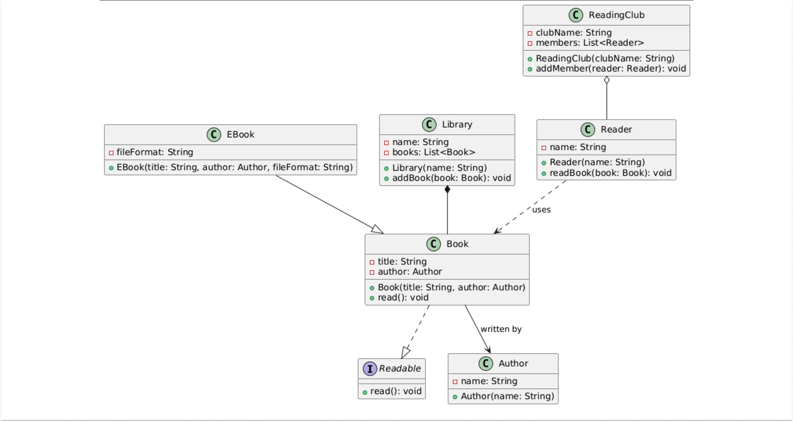

# 🌳 Class Relationships in Java

> *Understanding how classes relate to each other is the foundation of good object-oriented design.*

---

## 🌲 The Family Tree of Classes: Inheritance

> *Inheritance represents an "is-a" relationship where a subclass inherits properties and behaviors from its parent class.*

Think of it like a family tree — just as a Dog is an Animal, a subclass extends the functionality of its superclass.

```java
// Parent class
class Animal {
    void eat() {
        System.out.println("Animal is eating.");
    }
}

// Subclass inheriting from Animal
class Dog extends Animal {
    void bark() {
        System.out.println("Dog barks: Woof Woof!");
    }
}

public class InheritanceDemo {
    public static void main(String[] args) {
        Dog dog = new Dog();
        dog.eat();  // Inherited behavior
        dog.bark(); // Specific behavior
    }
}
```

**UML Diagram:**
```
┌─────────────┐
│   Animal    │
│─────────────│
│ • eat()     │
└──────▲──────┘
       │
┌──────┴──────┐
│    Dog      │
│─────────────│
│ • bark()    │
└─────────────┘
```

### 🧩 Explanation:
- `Animal` is the parent class with a basic `eat()` method.
- `Dog` extends `Animal` and adds its own `bark()` method.
- The `Dog` class **inherits behavior** from `Animal` while adding its unique actions.

---

## 💛 Side by Side: Association

Association is a **general relationship** where one class knows about or uses another. It's like a friendship — two entities are aware of each other, but they exist **independently**.

```java
// A Person can have a Car.
class Car {
    String model;
    Car(String model) {
        this.model = model;
    }
    void drive() {
        System.out.println("Driving a " + model);
    }
}

class Person {
    String name;
    // Association: A Person "has a" Car.
    Car car;
    Person(String name, Car car) {
        this.name = name;
        this.car = car;
    }
    void goForDrive() {
        System.out.println(name + " is going for a drive.");
        car.drive();
    }
}

public class AssociationDemo {
    public static void main(String[] args) {
        Car car = new Car("Tesla Model 3");
        Person person = new Person("Alice", car);
        person.goForDrive();
    }
}
```

**UML Diagram:**
```
┌──────────────────────────────┐
│           Person             │
│──────────────────────────────│
│ name: String                 │
│ car: Car                     │
│ Person(name: String, car:Car)│
│ goForDrive(): void           │
└──────────────┬───────────────┘
               │  has a
               ▼
┌──────────────────────────────┐
│             Car              │
│──────────────────────────────│
│ model: String                │
│ Car(model: String)           │
│ drive(): void                │
└──────────────────────────────┘
```

### 🧩 Explanation:
- `Person` has a reference to `Car`, representing an association.
- Both `Person` and `Car` exist **independently**. The `Car` doesn't rely solely on the `Person` for its existence.

---

## 🤗 Aggregation: Grouping with a Twist

Aggregation is a specialized form of association that represents a **"has-a" relationship** where the parts can exist independently of the whole — but they are grouped together by a container. Think of a **Team and its Players**: a team has players, yet the players can exist even if the team is disbanded.

```java
import java.util.ArrayList;
import java.util.List;

class Player {
    String name;
    Player(String name) {
        this.name = name;
    }
}

class Team {
    String teamName;
    // Aggregation: A team "has" players.
    List<Player> players = new ArrayList<>();
    Team(String teamName) {
        this.teamName = teamName;
    }
    void addPlayer(Player player) {
        players.add(player);
    }
    void showTeam() {
        System.out.println("Team " + teamName + " has players:");
        for (Player p : players) {
            System.out.println(" - " + p.name);
        }
    }
}

public class AggregationDemo {
    public static void main(String[] args) {
        Team team = new Team("Warriors");
        team.addPlayer(new Player("Stephen"));
        team.addPlayer(new Player("Klay"));
        team.showTeam();
    }
}
```

**UML Diagram:**
```
┌─────────────────────────────────┐
│              Team               │
│─────────────────────────────────│
│ teamName: String                │
│ players: List<Player>           │
│ Team(teamName: String)          │
│ addPlayer(player: Player): void │
│ showTeam(): void                │
└────────────────◇────────────────┘
                 │ 1
                 │ has
                 │ *
        ┌────────┴────────┐
        │     Player      │
        │─────────────────│
        │ name: String    │
        │ Player(name:    │
        │ String)         │
        └─────────────────┘
```

### 🧩 Explanation:
- `Team` **aggregates** `Player` objects.
- Players exist independently of the team — they can join or leave different teams.
- While the `Team` holds and manages `Player` instances, the players are **not solely dependent on the team** for their existence.

---

### 🔑 Key Differences Between Association and Aggregation

- **Association** is a general relationship (friendship) with **no ownership implied**; objects simply interact or use each other.
- **Aggregation** represents a "has-a" relationship where one object (the whole) contains or references other objects (the parts), but the **parts can exist independently** of the whole.

---

## ❤️ Bond for Life: Composition

Composition is a **stronger form of aggregation** with full ownership — if the whole is destroyed, the parts **cannot exist independently**. Think of a **House and its Rooms**: without the house, the rooms cease to exist.

```java
class Room {
    String name;
    Room(String name) {
        this.name = name;
    }
}

class House {
    // Composition: A House is composed of Rooms.
    private Room livingRoom;
    private Room kitchen;
    House() {
        // Rooms are created and owned by the House.
        livingRoom = new Room("Living Room");
        kitchen = new Room("Kitchen");
    }
    void showHouse() {
        System.out.println(
            "House contains: " + livingRoom.name + " and " + kitchen.name);
    }
}

public class CompositionDemo {
    public static void main(String[] args) {
        House house = new House();
        house.showHouse();
    }
}
```

**UML Diagram:**
```
        ┌──────────────────────────┐
        │          House           │
        │──────────────────────────│
        │ livingRoom: Room         │
        │ kitchen: Room            │
        │ House()                  │
        │ showHouse(): void        │
        └───────◆──────────◆───────┘
         1 /livingRoom  kitchen\ 1
          1                    1
        ┌──────────────────────────┐
        │           Room           │
        │──────────────────────────│
        │ name: String             │
        │ Room(name: String)       │
        └──────────────────────────┘
```

### 🧩 Explanation:
- `House` creates and **controls the lifecycle** of `Room` objects.
- The `Room` objects **do not exist** outside the context of the `House`.
- The composition relationship indicates that a `House` is composed of `Room` objects, meaning the rooms are created and owned by the house and **do not exist independently**.

---

## ⏳ Just a Little Dependency: Dependency

Dependency represents a **temporary relationship** where one class uses another class, typically via method parameters or local variables. It's like **borrowing a tool for a short while**.

```java
class Printer {
    void print(String message) {
        System.out.println("Printing: " + message);
    }
}

class Document {
    String content;
    Document(String content) {
        this.content = content;
    }
    // Dependency: Document uses Printer to print its content.
    void printDocument(Printer printer) {
        printer.print(content);
    }
}

public class DependencyDemo {
    public static void main(String[] args) {
        Document doc = new Document("Hello, World!");
        Printer printer = new Printer();
        doc.printDocument(printer);
    }
}
```

**UML Diagram:**
```
┌────────────────────────────────────┐
│            Document                │
│─────────────────────────────────── │
│ content: String                    │
│ Document(content: String)          │
│ printDocument(printer:Printer):void│
└────────────────┬───────────────────┘
                 │ uses (dashed)
                 ▼
        ┌────────────────────────┐
        │        Printer         │
        │────────────────────────│
        │ print(message:String): │
        │ void                   │
        └────────────────────────┘
```

### 🧩 Explanation:
- `Document` doesn't **store** a `Printer`; it simply uses one when needed.
- The relationship is **transient** and exists only during the method call.

---

### 🔑 Key Differences Between Association and Dependency

🔗 **Association:**
Objects are passed (often via constructors or setters) and stored as **persistent fields**. This creates a long-term relationship where the object is available throughout the lifetime of the class. For example, a `Person` stores a reference to a `Car` and uses it whenever needed.

➡️ **Dependency:**
Objects are passed as **method parameters** and used only within that method's scope. This creates a short-term, temporary relationship where the object is used just for the duration of the method call and isn't stored for later use. For example, a `Document` receives a `Printer` to print its content and doesn't keep a reference to the `Printer` afterward.

---

## 🎭 Walking the Interface Tightrope: Realization (Interface Implementation)

Realization represents a relationship where a **class implements an interface**. It's like signing a contract to provide specific behaviors.

```java
interface Payment {
    void pay();
}

class CreditCardPayment implements Payment {
    @Override
    public void pay() {
        System.out.println("Paid using Credit Card.");
    }
}

class CashPayment implements Payment {
    @Override
    public void pay() {
        System.out.println("Paid using Cash.");
    }
}

public class RealizationDemo {
    public static void main(String[] args) {
        Payment payment1 = new CreditCardPayment();
        Payment payment2 = new CashPayment();
        payment1.pay();
        payment2.pay();
    }
}
```

**UML Diagram:**
```
              ┌─────────────┐
              │  «interface»│
              │   Payment   │
              │─────────────│
              │ • pay()     │
              └──────┬──────┘
            ◁- - -   │   - - -▷
           /                   \
┌──────────────────┐   ┌─────────────────┐
│ CreditCardPayment│   │   CashPayment   │
│──────────────────│   │─────────────────│
│ • pay()          │   │ • pay()         │
└──────────────────┘   └─────────────────┘
```

### 🧩 Explanation:
- `Payment` is an interface that declares the `pay()` method.
- `CreditCardPayment` and `CashPayment` **implement this interface**, providing their own versions of `pay()`.

---

## 🚀 Bringing It All Together

Here is a **simplified library management system** that demonstrates all five relationships at once:



### 🧩 Explanation

📖 **Readable Interface:**
Defines a contract with a `read()` method. The `Book` class implements this interface, ensuring that all books provide a reading behavior.

🎲 **Book and EBook:**
`Book` has attributes for `title` and an associated `Author`. `EBook` extends `Book` by adding a `fileFormat` attribute. The inheritance arrow (solid line with a closed arrowhead) shows that `EBook` is a specialized type of `Book`.

🔗 **Association (Book & Author):**
The arrow from `Book` to `Author` indicates that every book is written by an author. This is a simple association where **both objects can exist independently**.

🟩 **Composition (Library & Book):**
The filled diamond from `Library` to `Book` indicates composition. A library is composed of books, meaning the **library strongly owns its books**.

📘 ➡️ 📕 **Dependency (Reader & Book):**
The dashed arrow from `Reader` to `Book` denotes a dependency. A reader **uses** a book (for example, to read), but **does not own it**.

🟩 ➡️ 👥 **Aggregation (ReadingClub & Reader):**
The open diamond from `ReadingClub` to `Reader` represents aggregation. A reading club groups readers together, but **readers can exist independently** of the club.

---

## 🎉 Wrapping Up Our Class Relationships Journey

Today, we've explored the **full spectrum of class relationships** — from the familial bonds of inheritance to the friendly connections of association, the groupings of aggregation, the strong ties of composition, the temporary links of dependency, and the contractual nature of realization. Each relationship plays a **vital role** in building clean, organized, and scalable systems.

Understanding these relationships — and how to represent them in **UML diagrams** — will help you design software that's both **robust and easy to maintain**. Keep exploring, keep coding, and most importantly, enjoy the process! 😄 👍