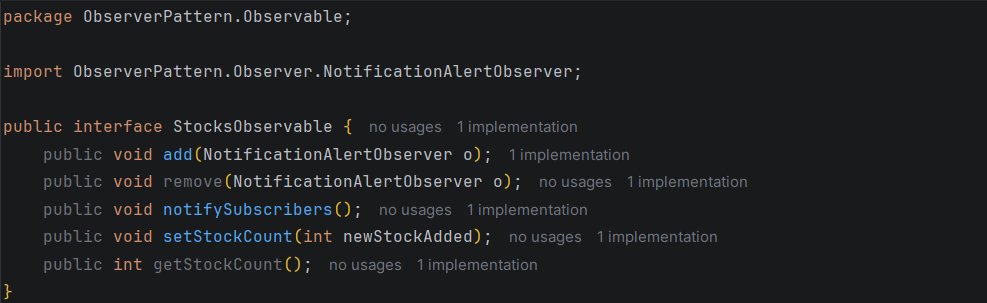
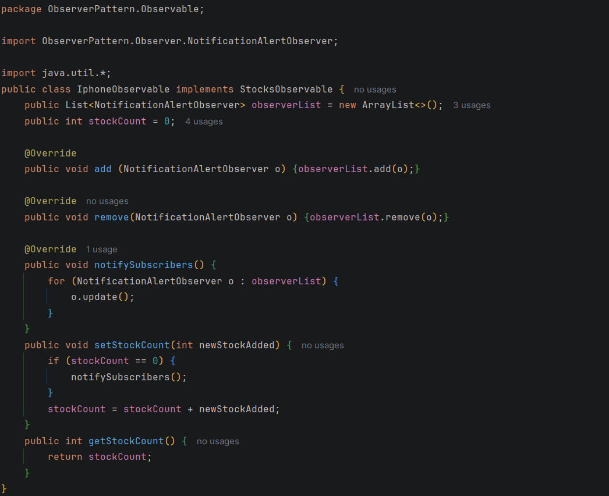
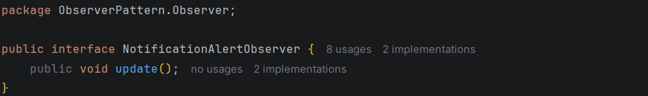
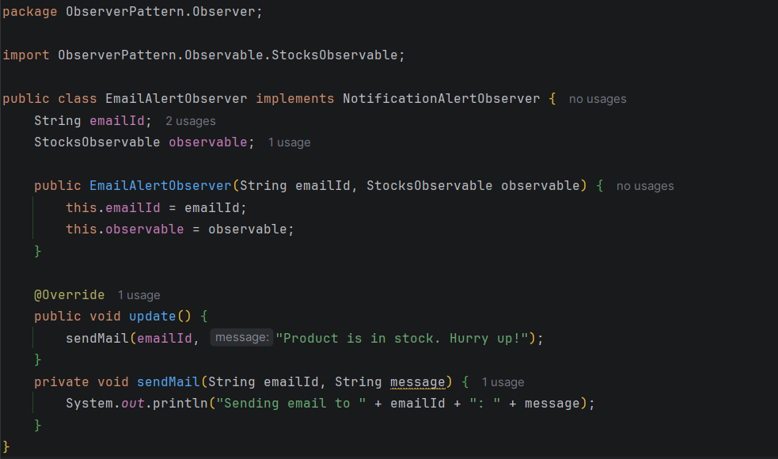
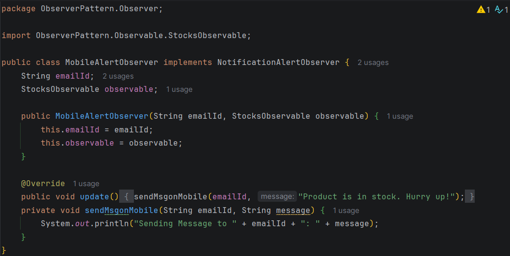
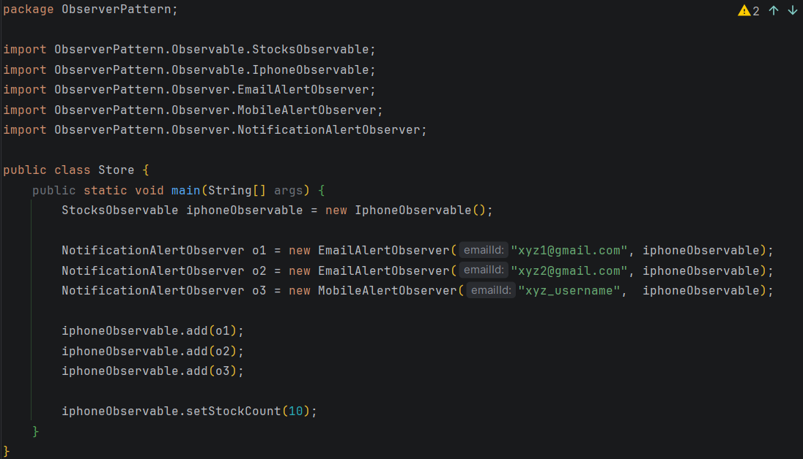

# 👁️ Observer Design Pattern

---

## 📖 Definition

> **The Observer pattern** is a **behavioral design pattern** that defines a **one-to-many dependency** between objects. When one object (the **subject**) changes state, all its **dependents (observers)** are **automatically notified and updated**.

---

## 🔴 PROBLEM STATEMENT

You have an object whose state changes over time, and **multiple other objects** need to know about these changes. The challenges are:

### 1️⃣ Tight Coupling
**Problem:** You don't want the subject to know the concrete details of all objects that need updates.

### 2️⃣ Dynamic Subscriptions
**Problem:** Objects should be able to **subscribe / unsubscribe** from updates at runtime.

### 3️⃣ Broadcast Communication
**Problem:** One change should **notify multiple interested parties automatically**.

### 4️⃣ Maintainability
**Problem:** Adding new observers shouldn't require **modifying the subject's code**.

---

## 🎯 Observer Pattern Solution

### 🏗️ Architecture Diagram

```
┌─────────────────────────────────┐              ┌──────────────────────┐
│   Observable Interface          │              │  Observer Interface  │
├─────────────────────────────────┤              ├──────────────────────┤
│ List<ObserverIntf> list;        │              │                      │
│                                 │   (0..*)     │  + update()          │
│ + add(ObserverIntf obj);        │─────────────>│                      │
│ + remove(ObserverIntf obj);     │   has-a      │                      │
│ + notify();                     │              │                      │
│ + setData();                    │              │                      │
│ + getData();                    │              │                      │
└─────────────────────────────────┘              └──────────────────────┘
                △                                           △
                │                                            │
                │ is-a                                       │ is-a
                │                                            │
┌───────────────────────────────┐              ┌──────────────────────┐
│ Observable Concrete Class     │              │ Observer Concrete    │
├───────────────────────────────┤              │ Class(es)            │
│ int data;                     │              │                      │
│ add(ObserverIntf obj) {       │              ├──────────────────────┤
│   list.add(obj);              │              │  ObservableInterface │
│ }                             │              │      obj;            │
│  remove(ObserverIntf obj) {   │              │  update() {          │
│    list.remove(obj);          │    has - a   │    obj.getData();    │
│ }                             │ ◄ ─────────  │  }                   │
│  modify() {                   │              │                      │
│      for (ObserverIntf obj :  │              │                      │
│                     list) {   │              │                      │
│           obj.update();       │              │                      │
│      }                        │              │                      │
│ }                             │              │                      │
│ setData (int t) {             │              │                      │
│      data = t;                │              │                      │
│      notify();                │              │                      │
│ }                             │              │                      │
└───────────────────────────────┘              └──────────────────────┘
```

# 📡 Observer Design Pattern

## 📚 Example 1: Weather Station

### 🎯 Scenario

- **🌡️ Observable**: Weather Station, whose task is to give current temperature.
- **👁️ Observer**: TV Display Observer, Mobile Display Observer.

---

### 📢 OBSERVABLE

#### Interface: Observable
```java
interface Observable {
    add(DisplayObserver obj);
    remove(DisplayObserver obj);
    notify();
    setTemp();
}
```

#### Implementation: WeatherStation
```java
class Observable implements Observable {
    List<DisplayObserver> displayList;
    int temp;
    
    add(DisplayObserver obj) {
        list.add(obj);
    }
    
    remove(DisplayObserver obj) {
        list.remove(obj);
    }
    
    notify() {
        for (DisplayObserver obj : displayList) {
            obj.update();
        }
    }
    
    setdata(int newTemp) {
        currentTemp = newTemp;
        notify();
    }
}
```

---

### 👀 OBSERVER

#### Interface: Observer
```java
interface Observer {
    update();
}
```

#### Implementation: MobileDisplayObserver
```java
class MobileDisplayObserver implements Observer {
    Observable obj;
    
    MobileDisplayObserver(Observable o) {
        this.obj = o;
    }
    
    void update() {
        // Update mobile display
    }
}
```

#### Implementation: TVDisplayObserver
```java
class TVDisplayObserver implements Observer {
    Observable obj;
    
    TVDisplayObserver(Observable o) {
        this.obj = o;
    }
    
    void update() {
        // Update TV display
    }
}
```

---

## 💻 CODE IMPLEMENTATION

### 📢 OBSERVABLE

#### 📄 StocksObservable Interface
**📁 Path:** `ObserverPattern / Observable / stocksObservable`



---

#### 📄 IphoneObservable Implementation
**📁 Path:** `ObserverPattern / Observable / iphoneObservable`



---

### 👀 OBSERVER

#### 📄 NotificationAlertObserver Interface
**📁 Path:** `ObserverPattern / Observer / NotificationAlertObserver`



---

#### 📄 EmailAlertObserver Implementation
**📁 Path:** `ObserverPattern / Observer / EmailAlertObserver`



---

#### 📄 MobileAlertObserver Implementation
**📁 Path:** `ObserverPattern / Observer / MobileAlertObserver`



---

### 🏪 MAIN CLASS: STORE

#### 📄 Store Class
**📁 Path:** `ObserverPattern / Store`



---

## 💡 Key Concepts

- 🔄 **Observable** maintains a list of observers and notifies them of state changes
- 👁️ **Observer** registers with observable and gets notified when state changes
- 🔔 When data changes, `notify()` is called automatically
- 📱 Multiple observers can listen to the same observable
- ➕ New observers can be added without modifying existing code (Open/Closed Principle)
- 🎯 Promotes loose coupling between objects